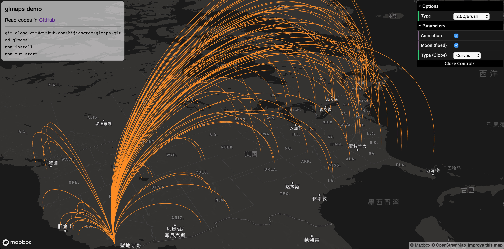
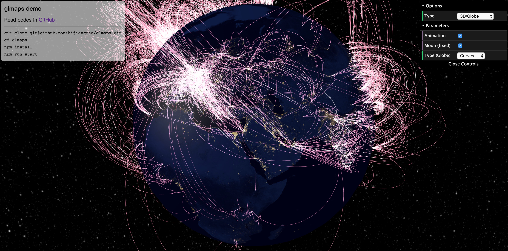
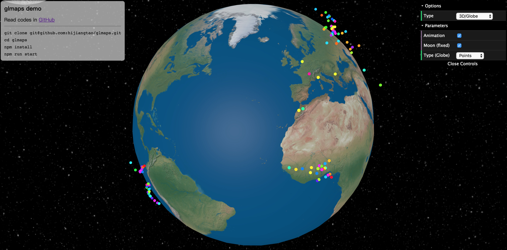
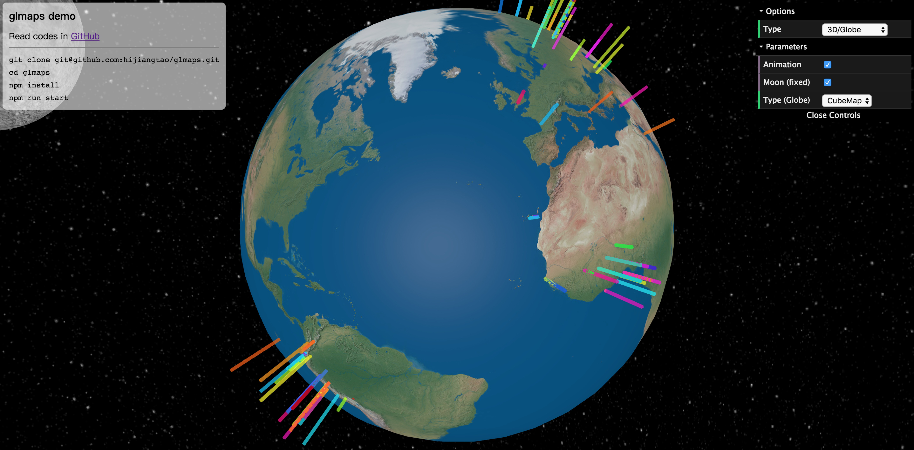
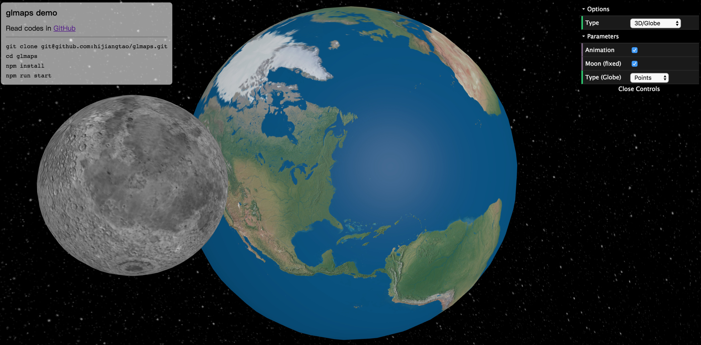

<p align="center"></p>

<h1 align="center">glmaps</h1>

<center>

时空可视化示例代码集与学习教程。

[](https://www.codacy.com/app/hijiangtao/glmaps?utm_source=github.com&utm_medium=referral&utm_content=hijiangtao/glmaps&utm_campaign=badger)
[](https://www.npmjs.com/package/glmaps)
[](https://github.com/hijiangtao/glmaps/releases)
[](https://www.npmjs.com/package/glmaps)
[]() 
[](https://github.com/hijiangtao/glmaps/issues) 
[](https://github.com/hijiangtao/glmaps/pulls) 
[](https://github.com/hijiangtao/glmaps/blob/master/LICENSE) 

[](https://nodei.co/npm/glmaps/)

</center>

## README 

[英文](./README.md) | [中文](./CN.md)

## glmaps 是什么？

glmaps 是一个包含多个时空可视化示例的代码集与学习教程，这是一个采用 MIT 协议的开源项目。该项目中的可视化效果基于可视化库 three.js 与 deck.gl 实现，非常容易上手，希望本项目对正在时空可视化学习之路上探寻的你有所帮助。

## 概览

|类型|描述|效果|支持动画|支持聚类|
|---|---|---|---|---|
|2.5D / Icon|与 deck 示例一致，无更改| [](./src/layers/IconLayer/index.js) | No | Yes |
|2.5D / Brush|支持弧线动画| [](./src/layers/ArcLayer/animate.js) | Yes | No |
|2.5D / Scatter|支持淡出动画| [](./src/layers/ScatterplotLayer/index.js) | Yes | No |
|2.5D / Hexagon|支持排序筛选| [](./src/layers/HexagonLayer/index.js) | Yes | Yes |
|2.5D / Grid|支持排序筛选| [](./src/layers/ScreenGridLayer/index.js) | No | Yes |
|2.5D / Trip|与 deck 示例一致，无更改| [](./src/layers/TripLayer/index.js) | Yes | No |
|3D / Curve|THREE.BufferGeometry()| [](./src/globe/index.js) | Yes | No |
|3D / Mover|THREE.SphereGeometry()| [](./src/globe/index.js) | Yes | No |
|3D / Cube|THREE.BoxGeometry()| [](./src/globe/index.js) | No | No |
|Other / Segment|与飞线动画效果一致| [](./src/globe/index.js) | No | No |
|Other / Moon|地月系统| [](./src/globe/index.js) | No | No |

## 本地运行 Demo

```
git clone git@github.com:hijiangtao/glmaps.git
cd glmaps
npm install
npm run start
```

## 从零开始学习时空可视化系列教程（待完善）

* 从零开始学习时空可视化（零） / 用 React 框架管理你的 three.js 项目 - TBD
* 从零开始学习时空可视化（一） / 用 three.js 画出你的第一个地球 - TBD
* 从零开始学习时空可视化（二） / 深入浅出 three.js 点、线、面、体的实现过程 - TBD
* 从零开始学习时空可视化（三） / 利用 props 与 transitions 让你的 deck.gl 图层动起来 - TBD
* 从零开始学习时空可视化（四） / 手写 shader 给你的 deck.gl 动画另辟蹊径 - TBD
* 从零开始学习时空可视化（五） / 使用 three.js 和 deck.gl 开发的踩坑记录 - TBD

## 安装

```
cd YOUR_REPO
npm install glmaps --save
```

## 用法

glmaps 的初衷是为了帮助那些在时空可视化领域缺乏基础但充满热情的初学者，利用 three.js 与 deck.gl 的能力帮助他们快速入门，因此 glmaps 不是一个为实际生产环境准备的可视化开源库。然而，glmaps 依然允许你像使用其他 package 一样在项目中正常引入，快写些 demo 试试效果吧。

```javascript
import React from 'react';
import {Globe} from 'glmaps';

/**
 * Data format:
 * [
 *   [
 *      source.lat,
 *      source.lng,
 *      target.lat,
 *      target.lng,
 *   ],
 *   ...
 * ]
 */
const Demo = (props) => {
  return (
    <Globe
      data={props.data}
      id={YOUR_MOUNT_DOM_ID}
      animate={true}
      moon={true}
      visType={'curve'}
    />
  )
};
```

更多示例与详细使用说明请见文档。

## 文档（待完善）

本部分仍处于完善阶段。然而，你现在就可以直接在 `src` 文件夹下查看所有示例代码集。

* [Layers (on Maps)](./layers/README.md)
  1. ArcLayer
  2. HexagonLayer
  3. IconLayer
  4. ScatterplotLayer
  5. ScreenGridLayer
  6. TripLayer
* [Globe](./globe/README.md)
  1. Curve
  2. Mover
  3. Cube

## 联系

@hijiangtao

## 协议

MIT