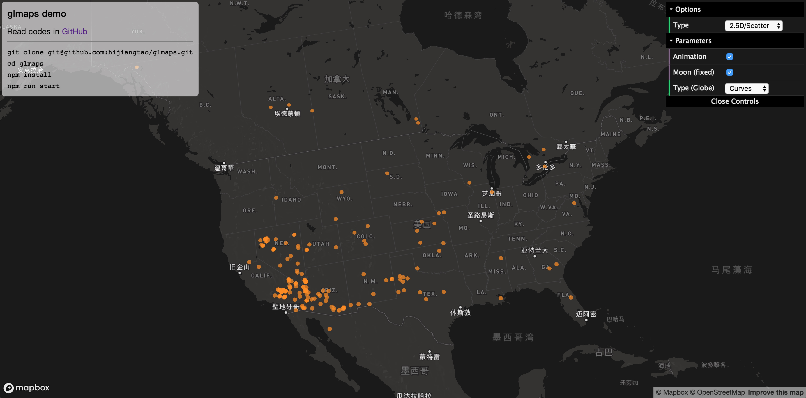
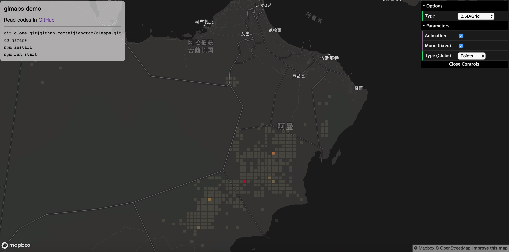

# glmaps
A node package full of bunch of earth and map visualization examples based on Three.js and Deck.gl, easy to learn and use. 

[](https://www.codacy.com/app/hijiangtao/glmaps?utm_source=github.com&utm_medium=referral&utm_content=hijiangtao/glmaps&utm_campaign=badger)
[]()
[]()
[]()
[]() 
[]() 
[]() 
[]() 

[](https://nodei.co/npm/glmaps/)

## Description

|Type|Description|Demo|Animation|Cluster|
|---|---|---|---|---|
|2.5D / Icon|No modification from deck| [](./src/layers/IconLayer/index.js) | No | Yes |
|2.5D / Brush|Support OD Arc Animation| [](./src/layers/ArcLayer/animate.js) | Yes | No |
|2.5D / Scatter|Support Fade-out Animation| [](./src/layers/ScatterplotLayer/index.js) | Yes | No |
|2.5D / Hexagon|Support Coverage Filter Conditions| [](./src/layers/HexagonLayer/index.js) | Yes | Yes |
|2.5D / Grid|Support Coverage Filter Conditions| [](./src/layers/ScreenGridLayer/index.js) | No | Yes |
|2.5D / Trip|No modification from deck| [](./src/layers/TripLayer/index.js) | Yes | No |
|3D / Curve|THREE.BufferGeometry()| [](./src/globe/index.js) | Yes | No |
|3D / Mover|THREE.SphereGeometry()| [](./src/globe/index.js) | Yes | No |
|3D / Cube|THREE.BoxGeometry()| [](./src/globe/index.js) | No | No |
|Other / Segment|The same as curve animation| [](./src/globe/index.js) | No | No |
|Other / Moon|Earth-Moon System| [](./src/globe/index.js) | No | No |


## Install

```
cd YOUR_REPO
npm install glmaps --save
```

## Tutorials (TBD)

* Manage your three.js application with React
* Draw a earth-moon system with three.js from scratch
* How to draw curve, mover and cube with three.js
* Animate your deck.gl with props and transitions
* Animate your deck.gl with shaders
* Some tips in visualizing data with deck.gl

## Usage

This is a package mainly designed for visualization lovers in learning Three.js and Deck.gl, however, you can use them as a normal package as other packages in npm.

```javascript
import {Globe} from 'glmaps';

/**
 * Data format:
 * [
 *   [
 *      source.lat,
 *      source.lng,
 *      target.lat,
 *      target.lng,
 *   ],
 *   ...
 * ]
 */
const Demo = (props) => {
  return (
    <Globe
      data={props.data}
      animate={true}
      moon={true}
      visType={'curve'}
    />
  )
};
```

More examples and detailed usage guidances can be found in documents.

## Document (TBD)

This part is still under constructing, however, you can access full codes in `src` folder.

* [Layers (on Maps)](./layers/README.md)
  1. ArcLayer
  2. HexagonLayer
  3. IconLayer
  4. ScatterplotLayer
  5. ScreenGridLayer
  6. TripLayer
* [Globe](./globe/README.md)

## Run the demo locally

```
git clone git@github.com:hijiangtao/glmaps.git
cd glmaps
npm install
npm run start
```

## Contact

@hijiangtao

## LICENSE

MIT