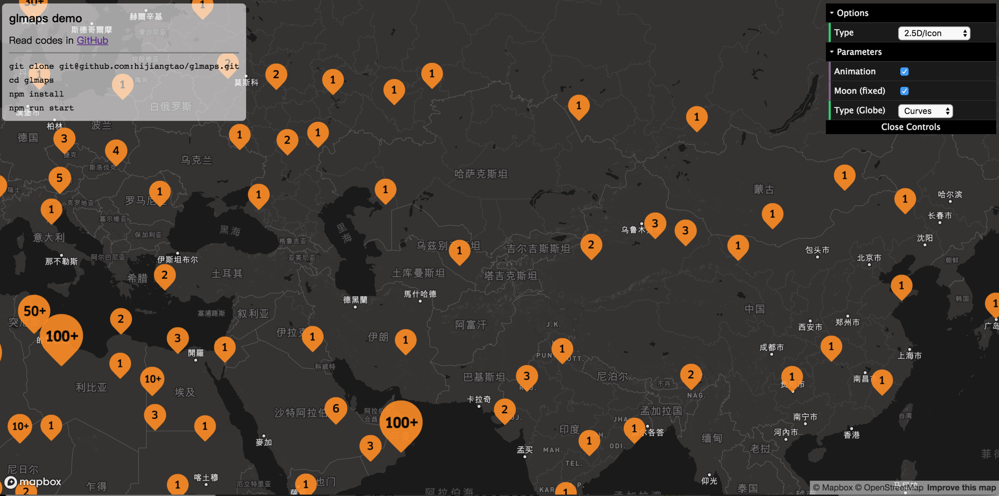
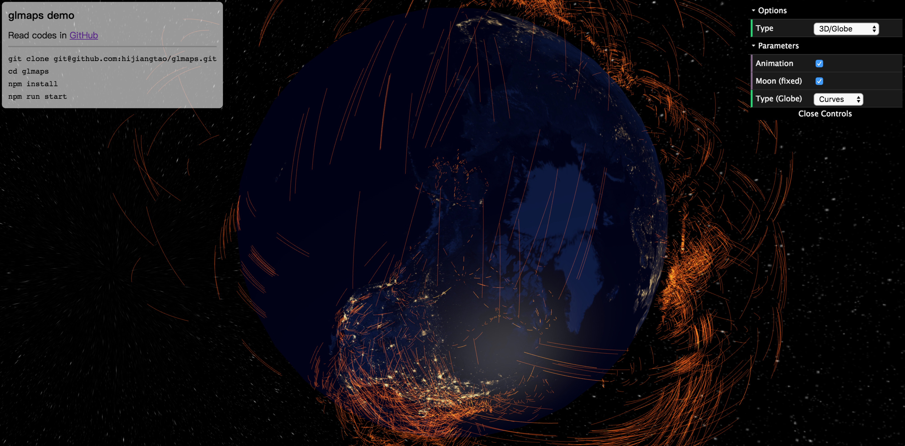

<p align="center"></p>

<h1 align="center">glmaps</h1>

<center>

Spatio-temporal data visualization example codes and tutorials from scratch.

[](https://www.codacy.com/app/hijiangtao/glmaps?utm_source=github.com&utm_medium=referral&utm_content=hijiangtao/glmaps&utm_campaign=badger)
[](https://www.npmjs.com/package/glmaps)
[](https://github.com/hijiangtao/glmaps/releases)
[](https://www.npmjs.com/package/glmaps)
[]() 
[](https://github.com/hijiangtao/glmaps/issues) 
[](https://github.com/hijiangtao/glmaps/pulls) 
[](https://github.com/hijiangtao/glmaps/blob/master/LICENSE) 

[](https://nodei.co/npm/glmaps/)

</center>

## README

[English](./README.md) | [Chinese](./CN.md)

## What is glmaps?

`glmaps` is a project full of bunch of earth and map visualization examples based on Three.js and Deck.gl, as well as some tutorials for visualization beginners. Easy to learn and use. 

## MENU

1. [Overview](#Overview) - Check all visualization types that `glmaps` contains.
2. [ZERO](#ZERO) - Some thoughts from me that you may pay attention before have future reading.
3. [Demo](#Demo) - Open browser and enter <https://localhost:8080> to check the demo locally.
4. [Tutorials](#Tutorials) - A series of tutorials that guide you how to code these visualization examples step by step. TBD.
5. [Install](#Install) - Installation guide for developers. Just have a try, `glmaps` has not get ready for industry applications.
6. [Usage](#Usage) - Usage for how to include `glmaps` in your application.
7. [Documents](#Documents) - API document for `glmaps`. TBD.
8. [Stories](#Stories) - Stories behind this repositry.
9. [Contact](#Contact)
10. [LICENSE](#LICENSE)

## Overview

Check all visualization types that `glmaps` contains, `2.5D` means you can draw 3D geometries on a 2D map, `3D` means a total 3D data visualization approach.

|Type|Description|Demo|Animation|Cluster|
|---|---|---|---|---|
|[3D / Curve](./src/globe/index.js)|THREE.BufferGeometry()| [](./src/globe/index.js) | Yes | No |
|[3D / Mover](./src/globe/index.js)|THREE.SphereGeometry()| [](./src/globe/index.js) | Yes | No |
|[3D / Cube](./src/globe/index.js)|THREE.BoxGeometry()| [](./src/globe/index.js) | No | No |
|[2.5D / Icon](./src/layers/IconLayer/index.js)|No modification from deck| [](./src/layers/IconLayer/index.js) | No | Yes |
|[2.5D / Brush](./src/layers/ArcLayer/animate.js)|Support OD Arc Animation| [](./src/layers/ArcLayer/animate.js) | Yes | No |
|[2.5D / Scatter](./src/layers/ScatterplotLayer/index.js)|Support Fade-out Animation| [](./src/layers/ScatterplotLayer/index.js) | Yes | No |
|[2.5D / Hexagon](./src/layers/HexagonLayer/index.js)|Support Coverage Filter Conditions| [](./src/layers/HexagonLayer/index.js) | Yes | Yes |
|[2.5D / Grid](./src/layers/ScreenGridLayer/index.js)|Support Coverage Filter Conditions| [](./src/layers/ScreenGridLayer/index.js) | No | Yes |
|[2.5D / Trip](./src/layers/TripLayer/index.js)|No modification from deck| [](./src/layers/TripLayer/index.js) | Yes | No |
|[Other / Segment](./src/globe/index.js)|The same as curve animation| [](./src/globe/index.js) | No | No |
|[Other / Moon](./src/globe/index.js)|Earth-Moon System| [](./src/globe/index.js) | No | No |

## ZERO

Thanks for your attention in this project, there are some thoughts from me that you may pay attention before have future reading.

**Q: What frameworks are used in `glmaps`?**

**React Hooks** is ready in 16.8.0, and `glmaps` get benefits from it at once, if you are not familiar with it, please check [Introducing Hooks](https://reactjs.org/docs/hooks-intro.html) first; On the other hand, deck.gl is **WebGL2** powered geospatial visualization layers, so please make sure your browser support WebGL2. To find out if WebGL(2) is enabled in your browser, go to <http://get.webgl.org/> or <https://get.webgl.org/webgl2/>. 

Besides, if you meet any errors when depoly it locally, you can describe your problem with [issues](https://github.com/hijiangtao/glmaps/issues/new), because that's most likely a problem of `glmaps` rather than yourself, since `glmaps` organizes local development environment from scratch, such as webpack, babel, etc.

**Q: Guidance for visualization beginners?**

I highly recommend you follows these steps in using `glmaps`:
  - Learn how to install three.js and deck.gl from scratch, and code your first "Hello World" with them;
  - Run official demos and get familiar with their API;
  - Follow the tutorials step by step to make your visualization examples more powerful, or check `glmaps` codes in `src` folder directly;
  - (Optional) Use `glmaps` in your demo application;
  - Rewrite `glmaps` example with your own codes;
  - Congratulations on mastering basics of spatio-temporal visualization, you can use `three.js` and `deck.gl` to draw a more fantastic world with spatio-temporal data!

**Q: How to participate in `glmaps` project?**

`glmaps` is still at the very beginning period of my thoughts, you are welcome to oepn ISSUE, PR or email me, if you have any ideas on how to make `glmaps` better for visualization beginners:
  - Participate in implementing tutorials together;
  - Contribute codes to `glmaps` with [PR](https://github.com/hijiangtao/glmaps/pulls) (such as imporve `mover` animation in `Globe`);
  - Speak out your doubts in learning data visualization with [issues](https://github.com/hijiangtao/glmaps/issues/new);
  - Tell me your advice on how to make `glmaps` better with [issues](https://github.com/hijiangtao/glmaps/issues/new);
  - Other aspects not included yet.

## Demo

Open browser and enter <https://localhost:8080> to check the demo locally. Please enjoy the power of `three.js` and `deck.gl`.

```
git clone git@github.com:hijiangtao/glmaps.git
cd glmaps
npm install
npm run start
```

## Tutorials

A series of spatio-temporal data visualization tutorials that guide you how to code these visualization examples step by step. TBD.

* Visualization Tutorials from scratch (I) - Introduction of data visualization with three.js
* Visualization Tutorials from scratch (II) - Introduction of data visualization with deck.gl
* Visualization Tutorials from scratch (III) - Manage your three.js application with React
* Visualization Tutorials from scratch (IV) - Draw a earth-moon system with three.js from scratch
* Visualization Tutorials from scratch (V) - How to draw curve, mover and cube with three.js
* Visualization Tutorials from scratch (VI) - Animate your layers with props and transitions
* Visualization Tutorials from scratch (VII) - Animate your deck.gl with customized shaders
* Visualization Tutorials from scratch (VIII) - Some tips in data visualization with deck.gl and three.js

## Install

The installation is for developers who wants to use `glmaps` in their demos.

```
cd YOUR_REPO
npm install glmaps --save
```

## Usage

This is a package mainly designed for visualization lovers in learning Three.js and Deck.gl, however, you can use them as a normal package as other packages in npm.

```javascript
import React from 'react';
import {Globe} from 'glmaps';

/**
 * Data format:
 * [
 *   [
 *      source.lat,
 *      source.lng,
 *      target.lat,
 *      target.lng,
 *   ],
 *   ...
 * ]
 */
const Demo = (props) => {
  return (
    <Globe
      data={props.data}
      id={YOUR_MOUNT_DOM_ID}
      animate={true}
      moon={true}
      visType={'curve'}
    />
  )
};
```

More examples and detailed usage guidances can be found in documents.

## Documents

This part is still under constructing, however, you can access full codes in `src` folder right now.

* [Layers (2.5D Map)](./layers/README.md)
  1. ArcLayer
  2. HexagonLayer
  3. IconLayer
  4. ScatterplotLayer
  5. ScreenGridLayer
  6. TripLayer
* [Globe (3D Space)](./globe/README.md)
  1. Curve
  2. Mover
  3. Cube
  4. Moon

## Stories

**Q: Why I create this repositry?**

A: I am really impressed by many open source developers when I learning how to visualize data on Web. They had contributed a lof of codes and resources in guiding beginners. I want to record what I learned and coded with these visualization frameworks, and hope that can raise your interests in data visualization, too.

## Contact

@hijiangtao

## LICENSE

MIT